# js-html_oyun
<h2>Winnie ve Arkadaşlarının Piknik Sepeti</h2>
Winnie ve Arkadaşları piknik yapmak için ormana gidecekler fakat piknik sepetine eşyalarını yerleştirmeleri gerekiyor. Eşyaları düzgün yerleştirmezlerse piknik sepeti devrilecek. Bu oyun, denge ve strateji üzerine kurulu bir oyundur.
  
<h2>Canlı Demo</h2>
Oyunun çalışan haline ulaşmak için tıklayın: 
 
<h2>Oyunun Temel Amacı ve Kurallar</h2>
Oyundaki temel amaç, sepetin dengesini koruyarak sağ tarafta bulunan malzemeler bölümündeki farklı ağırlıklardaki eşyaları sepetin içinde istediği noktalara yerleştirmektir. Bu yerleşime göre, sepet merkeze olan uzaklık ve konulan eşyanın ağırlığına göre sağa veya sola yatar.   
<h4>Denge Mekaniği:</h4> Sepet, içine konulan eşyaların ağırlıklarına ve konuldukları yere göre sağa veya sola yatar.  
<h4>Kritik Kural:</h4> Denge barından kontrol ettiğimiz sepetin dengesi %30'un altına düştüğünde sepet devrilir ve oyun sona erir.  
<h4>Kazanma Kuralı:</h4> Sepetin içinde bulunan 20 ızgara bölümünün hepsini sepetin dengesi korunarak doldurmuş olmak.  

<h2>Kontrol Mekanizması</h2>
<h4>Fare (Mouse):</h4> Malzemeler bölümünden istenilen bir eşya sadece 'Sol Tık' ile sepetin içinde istenilen bir bölüme taşınabilir.  
<h4>Sürükle-Bırak:</h4> Eşyalar fare ile sürükleme sayesinde istediğiniz bir noktaya yerleştirilebilir.  

<h2>Oyun İçi Görüntüler</h2>  

<h2>Teknik Özellikler</h2>
<h4>Kullanılan Diller:</h4> HTML5, CSS3, JavaScript  
<h4>Canvas:</h4> Tüm oyun alanı ve animasyonlar 'context2d' kullanılarak HTML5 Canvas üzerine kodlanmıştır.  
<h4>Fizik Hesaplamaları:</h4> Moment hesabı (Moment = Ağırlık x Uzaklık), hareket hesabı (Hareket = Moment x 0.0003) ile ve ters rotasyon ile oyunun denge sistemi kurulmuştur.  

<h2>Projeyi Nasıl İndirebilirsiniz?</h2>
Projeyi klonlayarak veya ZIP olarak indirebilirsiniz.   

<h2>Projeyi Nasıl Çalıştırabilirsiniz?</h2>
Proje sunucu gerektirmez, doğrudan tarayıcıda açabilirsiniz. Projeyi klonlayarak veya .zip dosyası olarak indirdikten sonra proje klasörüne girin. Daha sonra index.html dosyasını tarayıcıda açın.  

<h2>Projeyi Geliştirenler</h2>
<li>Ayşe Şevval Çokaslan</li>
<li>Zeynep Hacıoğlu</li>

<h2>Proje Yapılırken Yararlanılan Oyun</h2>
<li>Noah’s Arks: https://diadas.itch.io/noahs-arks</li>

<h2>Projede Kullanılan Görseller ve Sesler</h2>
<h4>Görseller</h4>
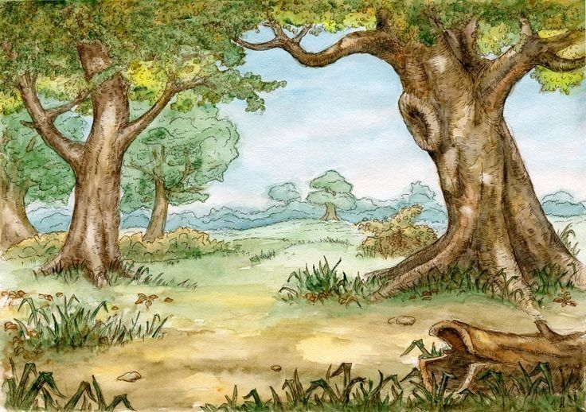
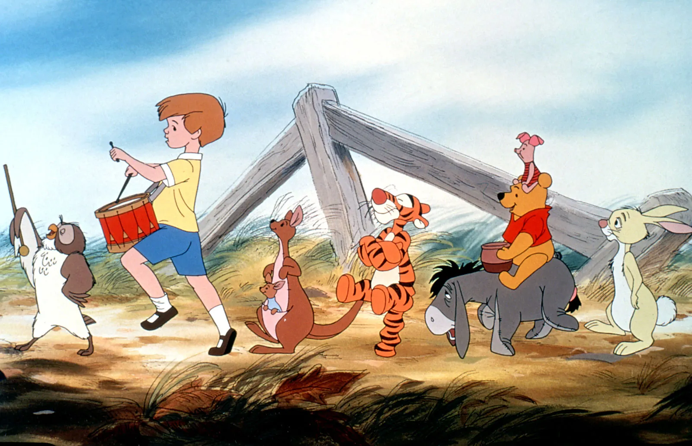
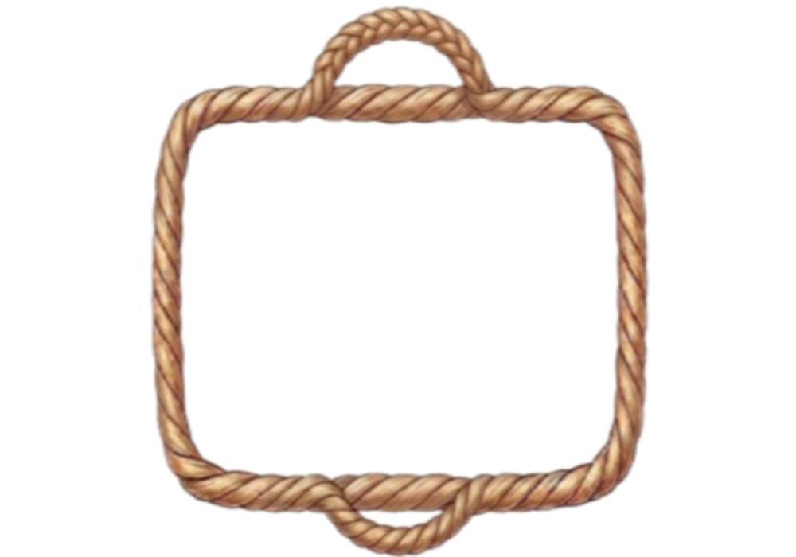
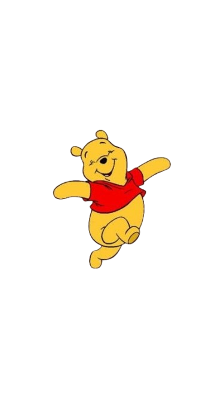
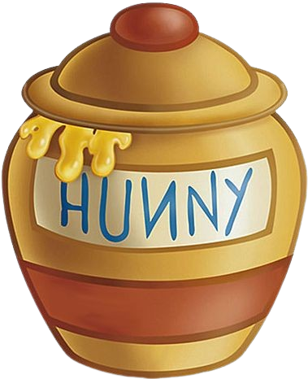
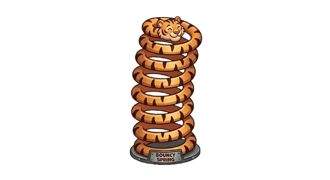
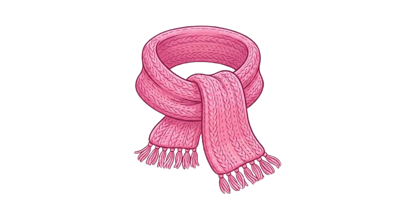
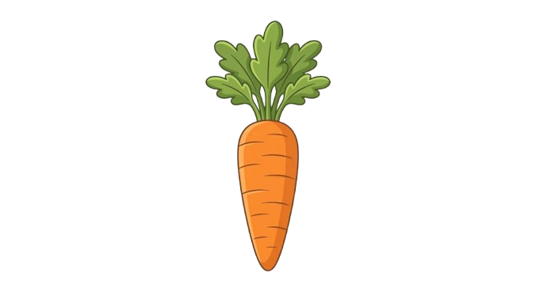
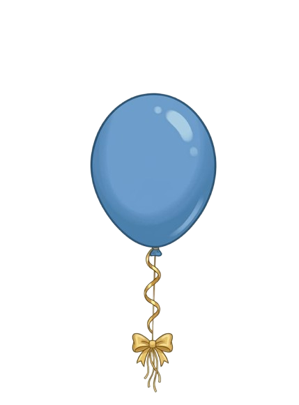
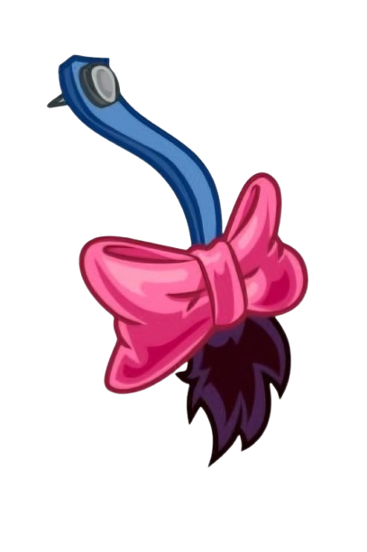
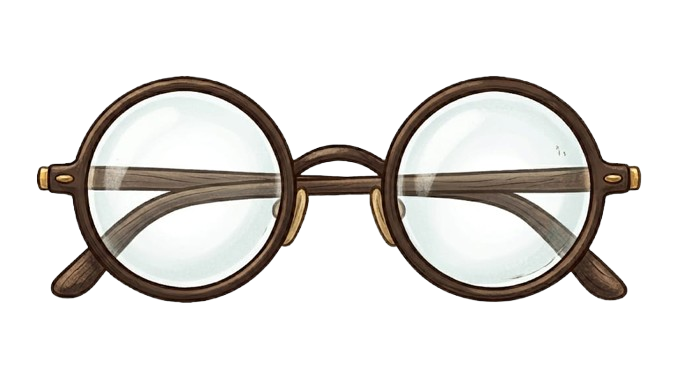

<h4>Sesler</h4>
## 🎵 Ses Dosyaları Listesi

| Ses Tanımı | Dosya Bağlantısı |
| :--- | :--- |
| **Fon Müziği** | [Dinlemek için tıklayın](assets/sesler/fon.mp3) |
| **Yerleşim Sesi** | [Dinlemek için tıklayın](assets/sesler/yerlesim.mp3) |
| **Level Atlama** | [Dinlemek için tıklayın](assets/sesler/level.mp3) |
| **Bitiş Sesi** | [Dinlemek için tıklayın](assets/sesler/bitis.mp3) |

   
